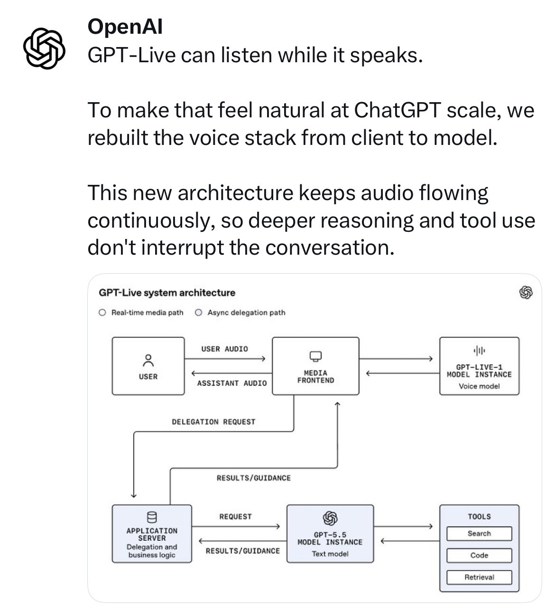
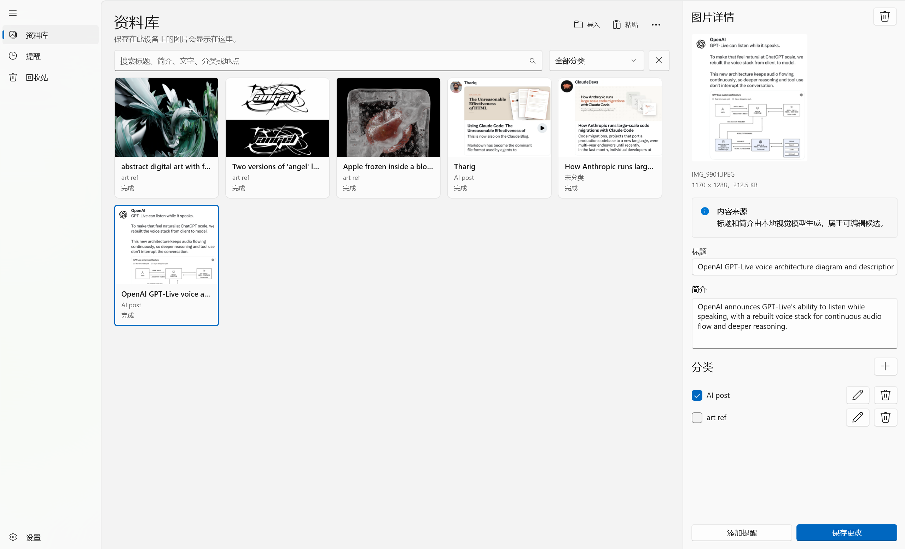
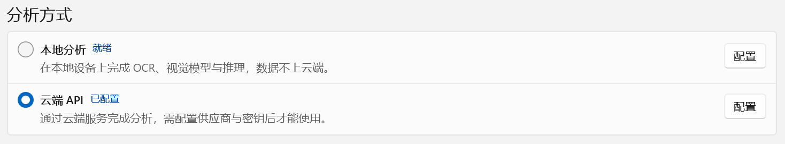
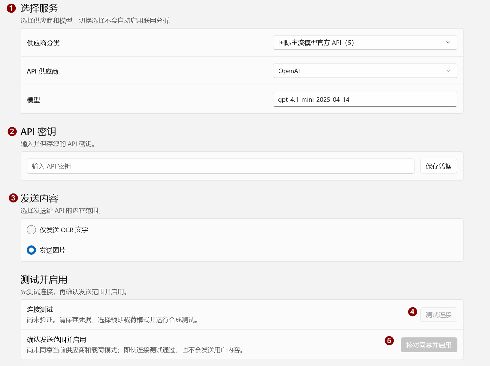
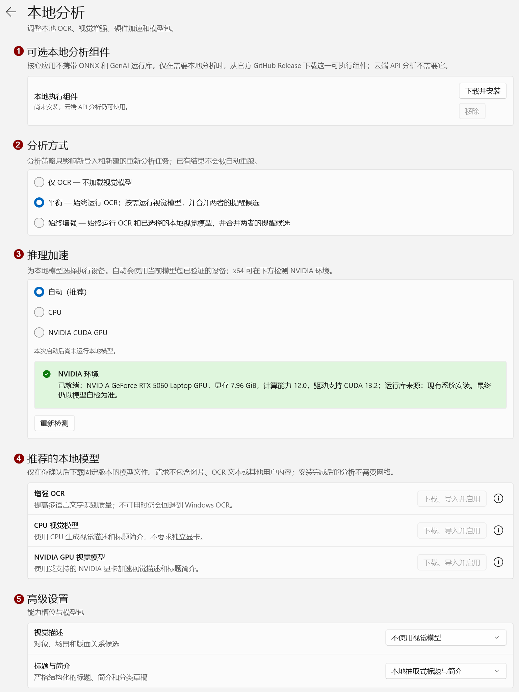
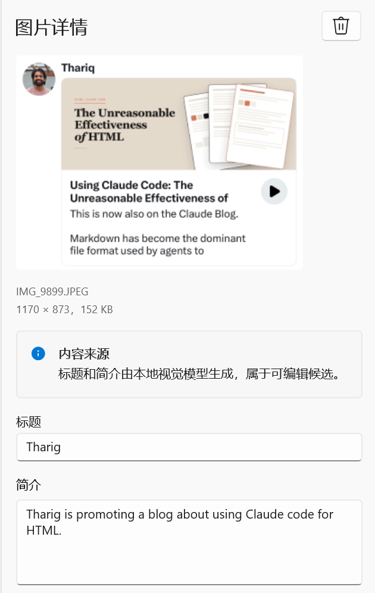
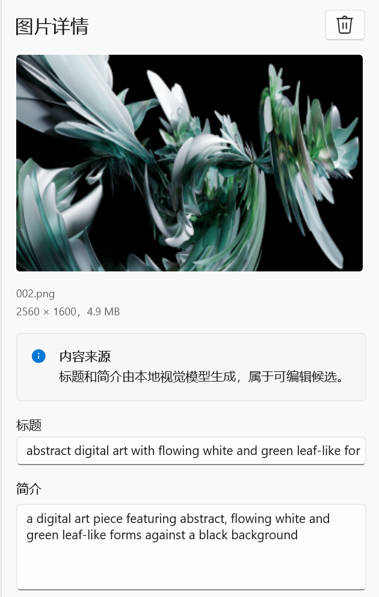

# PicForLater

PicForLater 是一款面向 Windows 的图片资料整理应用，用来保存那些“现在没空看，但之后还想认真看”的图片。

导入图片后，PicForLater 会保留不可变原图，并可通过**本地分析**或用户明确启用的**第三方 API**生成标题、简介、分类和提醒候选；分析结果由用户确认后再写入资料库或创建提醒。

当前发行目标是 **unpackaged WinUI 3 桌面程序**：仅通过 GitHub Releases 提供按架构区分的传统 `Setup.exe`，不发布应用 MSIX，也不在安装包中内置大型模型或本地 ONNX/CUDA 推理组件。

## 使用场景

例如，你在浏览贴文时看到一条值得细读的内容，但当下没有时间：

1. 使用 <kbd>Win</kbd> + <kbd>Shift</kbd> + <kbd>S</kbd> 截图；
2. 将截图粘贴到 PicForLater；
3. 让应用生成标题和简介，并按需分类；
4. 等有时间时，再通过搜索、分类或摘要快速找回这张图。

<table>
  <tr>
    <td width="42%" align="center">
      
      <br>
      <sub>原始截图：稍后想继续阅读的内容</sub>
    </td>
    <td width="58%" align="center">
      
      <br>
      <sub>导入后：可在资料库中查看标题、简介与分类</sub>
    </td>
  </tr>
</table>

> 图片来源：OpenAI 的 X 贴文截图。

不只是贴文：只要是图片，都可以保存到 PicForLater，并按需生成标题、简介和分类，方便之后检索和回忆。

## 功能

- 导入、搜索、分类、查看和回收图片。
- 从图片内容提取日期、时间、地点和提醒候选；提醒仅在用户确认后创建。
- 使用 Windows 内置 OCR，也可按需安装增强的本地 OCR / 视觉模型。
- 支持本地模型、第三方 API，以及兼容接口的自定义服务。
- 提供中文和英文界面，支持深色模式与高对比度。
- 无账号、无广告、无产品遥测。

## 系统要求与安装

- Windows 10 版本 2004（Build 19041）或更高版本。
- 前往 [Releases](https://github.com/dogdreamson555/PicForLater/releases/) 下载与设备架构一致的安装程序：
  - `PicForLater-Setup-<version>-x64.exe`
  - `PicForLater-Setup-<version>-arm64.exe`

> [!WARNING]
> 当前安装程序未进行代码签名，因此 Windows SmartScreen、Smart App Control 或组织策略可能显示警告或阻止运行。
> 如果你信任本项目并确认安装包来自本仓库的 GitHub Releases，可在 SmartScreen 中选择“更多信息” → “仍要运行”。项目代码已全部开源。

## 快速启用分析

PicForLater 支持两种主要分析方式：**本地分析**与**远程 API**。

<p align="center">
  
</p>

### 远程 API

应用内置了常见服务商预设。通常只需选择服务商、填写 API Key 并测试连接即可启用；如果服务商要求通过系统环境变量提供密钥，则需要按对应服务商的要求自行配置。

| 类型                     | 已内置的服务商 / 接口                                                                                                                 |
| ------------------------ | ------------------------------------------------------------------------------------------------------------------------------------- |
| 国际主流模型官方 API     | OpenAI、Anthropic / Claude、Google Gemini、xAI / Grok、Perplexity Sonar                                                               |
| 中国主流模型官方 API     | DeepSeek、月之暗面 / Kimi、腾讯混元、火山引擎 / 豆包、阿里云百炼 / 通义千问 Qwen、智谱 BigModel / GLM、百度智能云千帆 / 文心、MiniMax |
| 多模型聚合与高速推理平台 | SiliconFlow / SiliconCloud、OpenRouter、Groq、Together AI                                                                             |
| 本地运行与私有化部署     | Ollama、vLLM                                                                                                                          |
| 其他                     | 自定义兼容接口                                                                                                                        |

> [!NOTE]
> 截至 2026-08-16，DeepSeek API 不能直接处理图片，因此 PicForLater 对其默认使用“仅发送 OCR 文字”：先在本地提取图片文字，再将文本发送给云端模型处理。

<p align="center">
  
</p>

启用步骤：

1. 在“供应商分类”中选择对应类型，并选择服务商。
2. 填入 API Key，点击“保存凭据”。
3. 选择发送内容。模型支持视觉输入时，推荐使用“发送图片”，通常能获得更准确的结果。
4. 点击“测试连接”确认配置可用。
5. 核对远程分析的数据发送范围并确认启用。

如果测试连接持续失败，可以在“高级设置”中将“思考规模”设为“关闭”后再次测试。若问题仍然存在，请确认 API Key、模型名称、Endpoint、账户余额 / 配额以及服务商当前状态。

### 本地分析

本地分析需要额外下载相关组件和模型，应用支持一键下载。

<p align="center">
  
</p>

启用步骤：

1. 一键下载本地分析组件。
2. 选择分析方式；如果设备性能允许，推荐使用“始终增强”。
3. 选择推理设备。
4. 一键下载推荐模型。
5. 如有需要，在“高级设置”中为不同场景指定不同模型。

推荐模型：

| 用途                | 模型                                                                                                                                                      | 说明                         |
| ------------------- | --------------------------------------------------------------------------------------------------------------------------------------------------------- | ---------------------------- |
| OCR                 | [PP-OCRv6-small](https://www.paddleocr.ai/latest/en/version3.x/algorithm/PP-OCRv6/PP-OCRv6.html)                                                           | 用于本地文字识别             |
| CPU 视觉模型        | [Qwen3-VL-2B CPU Q4F32](https://huggingface.co/DogDreamson/picforlater-qwen3-vl-2b-onnx/tree/b0ffadcc56e0e736aa1310ff75f7c81147ac50bb/cpu-q4f32-rtnlast)   | 面向 CPU 的量化版本          |
| NVIDIA GPU 视觉模型 | [Qwen3-VL-2B CUDA Q4F16](https://huggingface.co/DogDreamson/picforlater-qwen3-vl-2b-onnx/tree/b0ffadcc56e0e736aa1310ff75f7c81147ac50bb/cuda-q4f16-rtnlast) | 面向 NVIDIA GPU 的 CUDA 版本 |

这些模型针对 PicForLater 的使用方式做了专门适配，目标是让多数常见电脑配置都能运行。

> [!IMPORTANT]
> NVIDIA GPU 视觉模型建议至少准备 **8 GB 显存**。

#### 推荐模型的分析结果示例

下面分别展示“贴文截图”和“复杂抽象图片”的分析结果。可以很看出，即便是复杂抽象图片，本地推荐的2B模型也能很好地将其描述出来

<table>
  <tr>
    <td width="50%" align="center">
      
      <br>
      <sub>贴文截图：生成标题与简介</sub>
    </td>
    <td width="50%" align="center">
      
      <br>
      <sub>复杂抽象图片：生成标题与简介</sub>
    </td>
  </tr>
</table>

> 左图内容来源：Thariq 的贴文；右图为开发者自己在Blender渲染导出的图片

## 常见问题

### 配置 API 时“测试连接”失败

先检查 API Key、模型名称、Endpoint、网络连接和账户配额。若配置看起来都正确，可以重试；如果仍然失败，再尝试将“高级设置”中的“思考规模”设为“关闭”。

### API 分析没有返回结果

1. 右键对应项目，选择“重新分析”。
2. 如果长时间仍无结果，可删除该项目，并在回收站中永久删除后重新拖入或粘贴图片。
3. 如果问题可以稳定复现，请提交 Issue，并说明 API 配置、实际操作步骤和错误表现。
4. 如果图片不包含隐私或敏感信息，也可以附上可复现问题的样例图片，帮助定位问题。

> [!CAUTION]
> 提交公开 Issue 时，请勿上传 API Key、私人图片、未公开漏洞细节或其他敏感信息。

## Privacy

PicForLater 默认本地运行，但不能笼统称为“完全离线”。以下是实际数据与网络边界：

| 模式或操作                       | 会发送 / 访问                                                                                                                                                                | 不会发送                                                                    |
| -------------------------------- | ---------------------------------------------------------------------------------------------------------------------------------------------------------------------------- | --------------------------------------------------------------------------- |
| 本地分析                         | 本机 Windows OCR；已安装时使用本地组件和模型。loopback Ollama / vLLM 由用户配置的本机服务处理                                                                                | PicForLater 不向远程分析供应商发送图片或 OCR                                |
| OCR 文字 API (`RemoteOcrText`) | 有长度上限的 OCR 纯文本、语言标签、输出语言策略、参考 UTC 时间 / 时区，以及所选模型、prompt / schema 和输出限制                                                              | 图片、缩略图、文件名、路径、内容哈希、内部 ID、框坐标、分类和其他资料库内容 |
| 图片 API (`RemoteVision`)      | 从不可变原图解码、按方向处理、转换到 sRGB、优先保留原分辨率（超过 1600 万像素或请求上限时才等比例缩小）、重新编码的临时 PNG；另含参考时间 / 时区、输出语言策略和固定请求契约 | 原图字节、EXIF / XMP、文件名、路径、哈希、内部 ID、OCR、分类和资料库上下文  |
| API 连接测试                     | 固定合成文字，或用户明确运行图片测试时发送仓库内授权猫图；测试可能计费                                                                                                       | 用户图片、用户 OCR 和资料库内容                                             |
| 按需下载                         | 用户确认后访问清单固定的 GitHub Releases、Hugging Face 或 NVIDIA 来源以取得组件、模型或运行库                                                                                | 不会后台自动下载大型模型；核心 Setup 的 Windows App Runtime 已离线携带      |

第三方 API 的数据保留、训练、地域、账号政策和费用取决于用户选择的供应商与计划；PicForLater 不能替供应商承诺零保留或不训练。取消任务可以阻止尚未发送的请求，但不能召回供应商已经收到的数据或费用。应用禁用 HTTP redirect 和 Cookie，不绕过 TLS 证书验证；公共自定义 endpoint 只允许 HTTPS，loopback 服务是受限例外。

生产数据位于 `%LocalAppData%\PicForLater`，包括 SQLite 数据库及备份、不可变原图、缩略图与缓存、staging、设置、模型和可选组件。远程图片副本只在内存中有界持有并在调用后释放。API Key 保存在当前 Windows 用户的 Credential Locker (`PasswordVault`) 中，不写入 SQLite、`settings.json`、任务快照或日志。

应用是普通 unpackaged 桌面进程，不具有 MSIX 容器隔离；它以当前用户权限访问用户选择或拖放的文件、应用管理的数据目录、用户明确触发的剪贴板读取、网络和 Windows 通知。Credential Locker 保护静态凭据，但不能防御同一用户权限下已经运行的恶意程序。

普通卸载会删除程序、快捷方式、通知注册和卸载项，但保留 `%LocalAppData%\PicForLater`。如需删除本地资料，先在应用中永久删除相关内容，或退出应用后自行删除整个数据目录；这不是安全擦除承诺。删除远程 profile / 本机凭据也不会吊销供应商后台密钥，必要时还应在供应商控制台撤销。

用户可在设置中切回本地模式、撤销远程同意、删除已保存凭据，或取消尚未发送的任务。相关固定边界见 [架构决策记录](docs/adr/)。

## Security

- API 凭据仅使用 Windows 当前用户 Credential Locker；日志、持久化错误和自动化测试不应包含 secret 或用户载荷。
- 模型和可选可执行组件按固定来源、大小、SHA-256 与签名清单验证；核心 Setup 不携带模型权重或本地推理 worker。
- Setup 由 GitHub Actions 在同一次 Release publish 中生成。首版未签名及 SmartScreen 风险如上所述。
- 安全问题的报告方式见 [SECURITY.md](SECURITY.md)。不要在公开 Issue 中粘贴密钥、私人图片、未公开漏洞细节或可利用样本。

## 从源码构建

需要：

- Windows；
- Visual Studio 2022 的 Windows App SDK / C++ 桌面构建组件；
- PowerShell 7；
- `global.json` 固定的 .NET SDK 10.0.302。

生成完整 Setup 还需要 Inno Setup 6；普通 build / test 和 Setup dry run 不要求本机安装 Inno。发布 workflow 的本地静态检查使用 actionlint 1.7.12，可通过 `-ActionlintPath` 指向经官方 SHA-256 校验的可执行文件，无需把该工具提交到仓库。

```powershell
dotnet restore .\PicForLater.slnx --locked-mode
dotnet build .\PicForLater.slnx -c Release --no-restore
dotnet test .\PicForLater.slnx -c Release --no-build --no-restore

# 真正的 unpackaged publish，并校验 Runtime、PRI/XBF、许可证和禁止文件；不编译 Setup.exe
.\tools\release\Build-Setup.ps1 -Platform x64 -DryRun

# 安装 Inno Setup 后构建本地 Setup；正式发行物仍只由 GitHub Actions 生成
.\tools\release\Build-Setup.ps1 -Platform x64
```

性能基线见 [docs/performance.md](docs/performance.md)。

## License

PicForLater 以 [MIT License](LICENSE.txt) 发布。第三方依赖、资源和按需组件的用途与来源见 [THIRD-PARTY-NOTICES.md](THIRD-PARTY-NOTICES.md)；随分发保留的上游许可证原文见 [licenses/README.md](licenses/README.md)。模型与第三方服务仍受各自条款约束。
