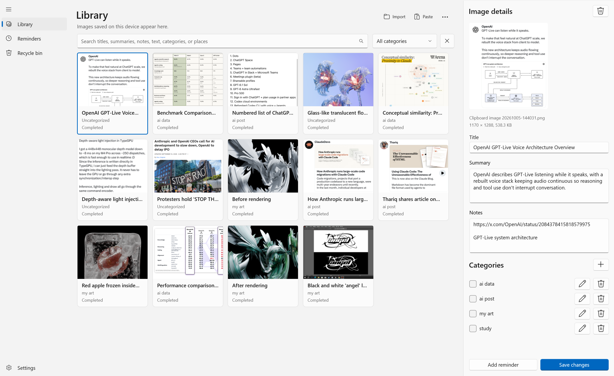
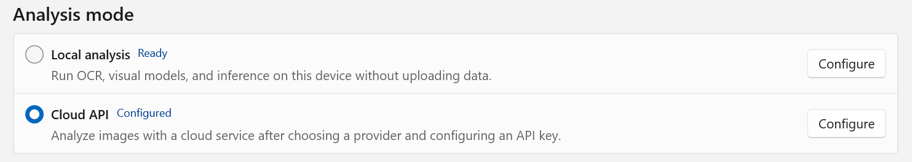
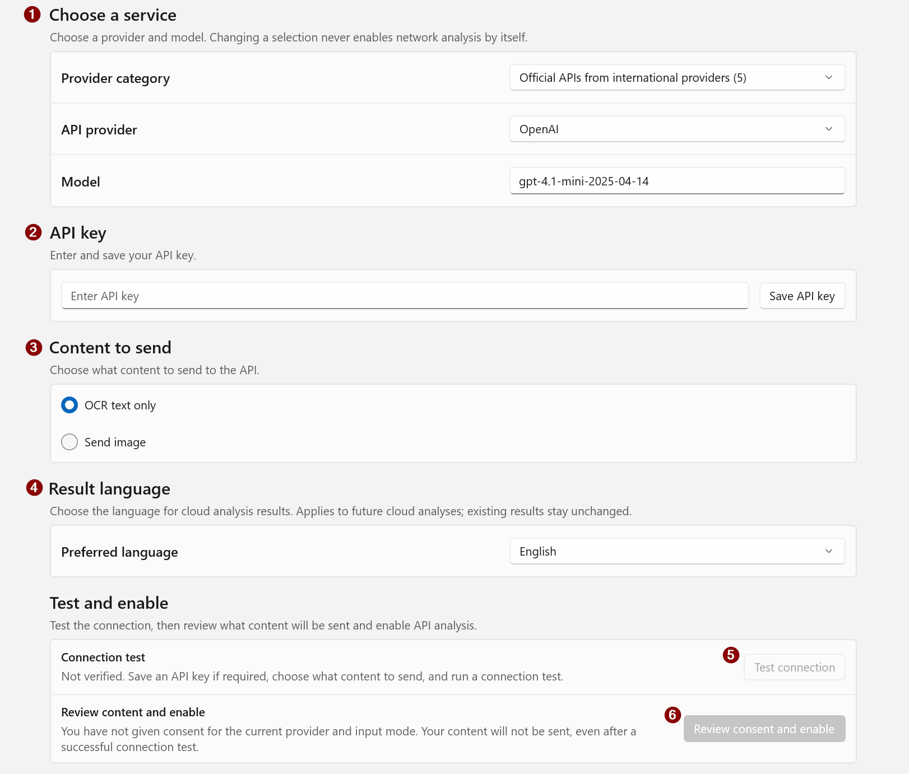
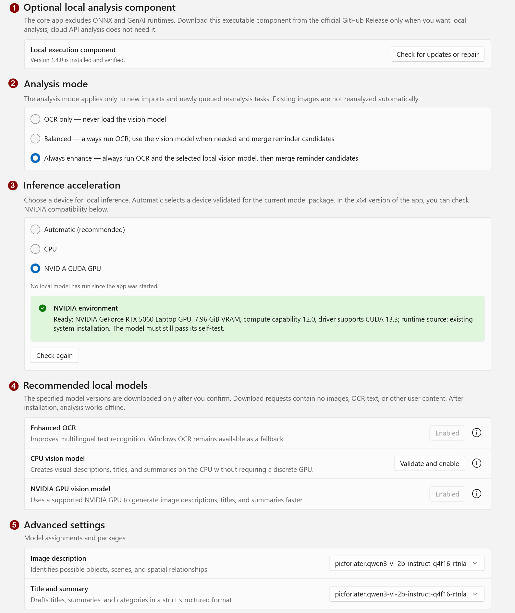
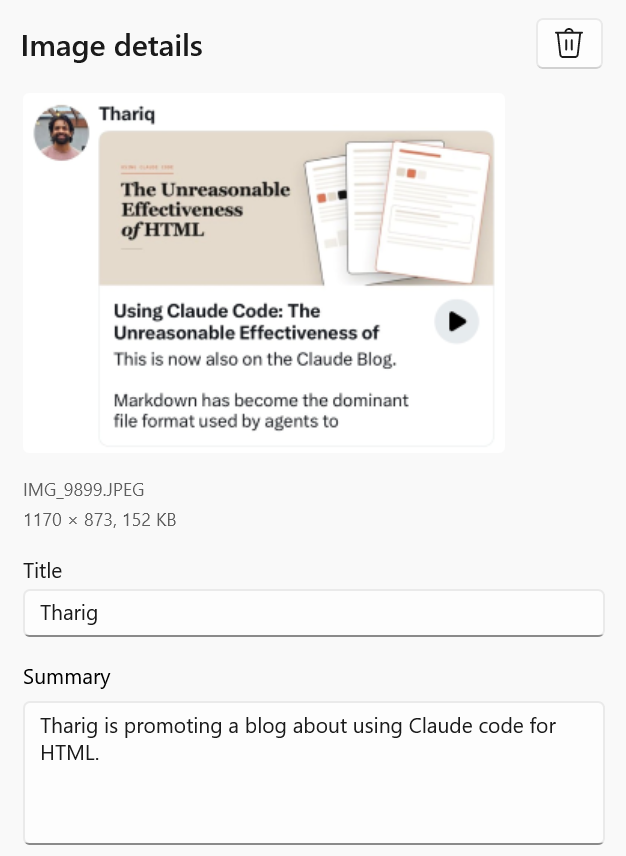
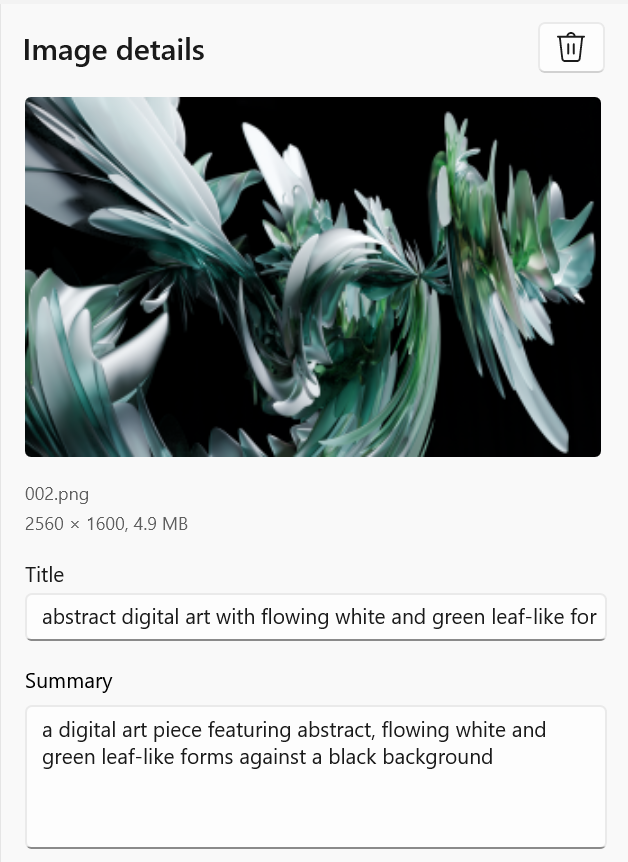
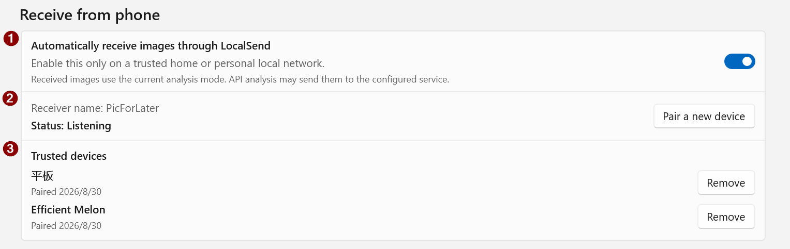

# PicForLater

**English** | [简体中文](README.zh-CN.md) | [繁體中文（台灣）](README.zh-TW.md)

PicForLater is an image organizer for Windows, designed for saving images you do not have time to look at now but want to revisit later.

When you import an image, PicForLater preserves an immutable original and can use **local analysis** or a **third-party API** you explicitly enable to generate a title, summary, categories, and suggested reminders. You confirm the analysis results before they are saved to the library or used to create reminders.

## Use case

For example, you come across a post worth reading carefully but do not have time right now:

1. Take a screenshot with <kbd>Win</kbd> + <kbd>Shift</kbd> + <kbd>S</kbd>.
2. Paste it into PicForLater.
3. Let the app generate a title and summary, and categorize it as needed.
4. When you have time, quickly find the image through search, categories, or summaries.

<table>
  <tr>
    <td width="42%" align="center">
      
      <br>
      <sub>Original screenshot: content to revisit later</sub>
    </td>
    <td width="58%" align="center">
      
      <br>
      <sub>After import: view the title, summary, and categories in the library</sub>
    </td>
  </tr>
</table>

> Image source: screenshot of an X post by OpenAI.

It is not limited to posts: you can save any image to PicForLater and generate titles, summaries, and categories as needed to make it easier to find and recall later.

## Features

- Import, search, categorize, view, and move images to the recycle bin.
- Extract dates, times, locations, and suggested reminders from images; reminders are created only after you confirm them.
- Use Windows' built-in OCR, with optional enhanced local OCR and vision models.
- Support for local models, third-party APIs, and custom services with compatible interfaces.
- Connect other devices to import and analyze images.
- An optional global shortcut opens the Windows snipping tool and automatically imports the new image after capture.
- Chinese and English interfaces, with dark mode and high contrast support.
- No account, ads, or product telemetry.

## System requirements and installation

Requires Windows 11, or a [Windows 10 LTSC / Enterprise version supported by .NET 10](https://learn.microsoft.com/dotnet/core/install/windows).

Download an installer from [Releases](https://github.com/dogdreamson555/PicForLater/releases/): choose `PicForLater-Setup-<version>-x64.exe` for Intel / AMD PCs, or `PicForLater-Setup-<version>-arm64.exe` for ARM64 PCs.

- **First installation**: stay connected to the internet. The installer automatically downloads and installs the required runtimes. Choose "Yes" if prompted for administrator permission.
- **Updates**: download and run the latest online installer.
- **Offline installation**: download the installer for your architecture with `Setup-Offline` in its filename, then copy it to the target PC and run it.

> [!WARNING]
> The installer is currently unsigned. After confirming that it came from this repository's Releases, choose "More info" → "Run anyway" if SmartScreen displays a warning.

## Set up analysis

PicForLater supports two main analysis methods: **local analysis** and **remote API**.

<p align="center">
  
</p>

### Remote API

Select a provider preset, enter your API key, and test the connection to configure remote analysis. If your provider requires the key to be supplied through a system environment variable, configure it according to that provider's instructions. See [Remote API providers](docs/remote-api-providers.md) for supported interfaces and capabilities.

| Category | Built-in providers / interfaces |
| --- | --- |
| Official APIs from major international providers | OpenAI, Anthropic / Claude, Google Gemini, xAI / Grok, Perplexity Sonar |
| Official APIs from major Chinese providers | DeepSeek, Moonshot AI / Kimi, Tencent Hunyuan, Volcengine / Doubao, Alibaba Cloud Model Studio / Tongyi Qianwen Qwen, Zhipu BigModel / GLM, Baidu AI Cloud Qianfan / ERNIE, MiniMax |
| Multi-model aggregators and fast inference platforms | SiliconFlow / SiliconCloud, OpenRouter, Groq, Together AI |
| Local and private deployments | Ollama, vLLM |
| Other | Custom compatible interfaces |

<p align="center">
  
</p>

Setup steps:

1. Choose the appropriate "Provider category" and API provider.
2. Enter your API key and click "Save API key".
3. Choose the content to send. If the model supports vision input, "Send image" is recommended and usually produces more accurate results.
4. Choose the result language.
5. Click "Test connection" to verify the configuration.
6. Review what data remote analysis will send and confirm that you want to enable it.

### Local analysis

Local analysis requires additional components and models, which the app can download in one click.

<p align="center">
  
</p>

Setup steps:

1. Download the local analysis component in one click.
2. Choose an analysis mode. "Always enhance" is recommended if your device can handle it.
3. Choose an inference device. If you use an NVIDIA GPU and the required runtimes are missing, click "Install runtime". See [Local runtime prerequisites](docs/qwen3-vl-runtime-prerequisites.md) for requirements.
4. Download the recommended models in one click.
5. If needed, assign different models to different tasks in "Advanced settings".

Recommended models:

| Purpose | Model | Description |
| --- | --- | --- |
| OCR | [PP-OCRv6-small](https://www.paddleocr.ai/latest/en/version3.x/algorithm/PP-OCRv6/PP-OCRv6.html) | Local text recognition |
| CPU vision model | [Qwen3-VL-2B CPU Q4F32](https://huggingface.co/DogDreamson/picforlater-qwen3-vl-2b-onnx/tree/b0ffadcc56e0e736aa1310ff75f7c81147ac50bb/cpu-q4f32-rtnlast) | Quantized version for CPUs |
| NVIDIA GPU vision model | [Qwen3-VL-2B CUDA Q4F16](https://huggingface.co/DogDreamson/picforlater-qwen3-vl-2b-onnx/tree/b0ffadcc56e0e736aa1310ff75f7c81147ac50bb/cuda-q4f16-rtnlast) | CUDA version for NVIDIA GPUs |

These models are specifically adapted for PicForLater, with the goal of running on most common PC configurations.

> [!IMPORTANT]
> At least **8 GB of VRAM** is recommended for the NVIDIA GPU vision model.

#### Analysis examples with the recommended models

The examples below show analysis results for a post screenshot and a complex abstract image. Even the complex abstract image is described well by the recommended local 2B model.

<table>
  <tr>
    <td width="50%" align="center">
      
      <br>
      <sub>Post screenshot: generated title and summary</sub>
    </td>
    <td width="50%" align="center">
      
      <br>
      <sub>Complex abstract image: generated title and summary</sub>
    </td>
  </tr>
</table>

> Image sources: a post by Thariq (left); an image rendered and exported from Blender by the developer (right).

## Connect your phone

<p align="center">
  
</p>

Setup steps:

0. Install [LocalSend](https://localsend.org/download) on your phone or tablet.
1. Enable "Automatically receive images through LocalSend".
2. Click "Pair a new device", send an image from the sending device, and enter the PIN to complete verification.
3. Once paired, the device appears under "Trusted devices" and future transfers do not require a PIN. The device name is configured in LocalSend.

## Frequently asked questions

### "Test connection" fails when configuring an API

Check the API key, model name, endpoint, network connection, account balance / quota, and service status first. If the configuration is correct but the test still fails, set "Reasoning effort" in "Advanced settings" to "Disabled" and try again.

### API analysis returns no results

1. Right-click the item and choose "Reanalyze".
2. If no results appear after a long wait, delete the item, permanently delete it from the recycle bin, then drag in or paste the image again.
3. If the issue is reproducible, open an Issue describing the API configuration, exact steps, and observed error.
4. If the image contains no private or sensitive information, you can also attach a sample image that reproduces the issue to help diagnose it.

### Image import fails

Check whether the file extension matches the actual format, such as a JPEG incorrectly renamed to PNG. Repair or re-export the image. Animated images are not currently supported.

### Problems receiving images from a phone

> [!CAUTION]
> When using PicForLater's LocalSend integration, close the official LocalSend app on your PC.

| Problem | Common causes | Suggested solution |
| --- | --- | --- |
| Your phone cannot find `PicForLater` at all | Different local networks, guest Wi-Fi / AP isolation, VPN, blocked UDP discovery, or disabled local network permission on iOS | Connect both devices to the same non-guest network; temporarily disable the VPN; disable AP Isolation on the router; or test with a personal hotspot |
| "Listening (discovery limited)" is displayed | UDP 53317 / multicast discovery failed, but the TCP service may still work | Check the firewall, VPN, and virtual network adapters; turn "Automatically receive images through LocalSend" off and on again |
| Your phone can find the app, but the connection times out or fails | TCP 53317 is blocked by the firewall or security software | Allow `PicForLater.App.exe` through the firewall on private networks first; do not permanently disable the firewall |
| "Service fault" is displayed | Port 53317 is in use by the desktop LocalSend app, another PicForLater instance, or another program | Fully exit the desktop LocalSend app and any extra PicForLater instances, then turn "Automatically receive images through LocalSend" off and on again |
| Your phone is rejected after selecting PicForLater | The new device is not paired, trust was removed, or the phone's certificate identity changed | Click "Pair a new device", enter the PIN within two minutes, and send at least one supported image |
| Transfer succeeds but import fails | HEIC / GIF / PDF, a mismatched extension, a damaged image, or exceeded limits | Re-export as a genuine JPEG / PNG / WebP; do not just rename the extension; split large batches |
| "Already exists" is displayed | The image content duplicates a file already in the library | This is normal deduplication, not a connection failure |

#### Blocked by the firewall

The current installer does not automatically create firewall rules, so a fresh PC may require manual configuration.

Preferred method:

1. Open "Windows Security".
2. Go to "Firewall & network protection".
3. Select "Allow an app through firewall".
4. Click "Change settings" → "Allow another app".
5. Select the installed `PicForLater.App.exe`.
6. Check only "Private".

Alternative method:

In "Advanced settings" → "Inbound Rules", allow:

- TCP local port 53317
- UDP local port 53317
- Private networks only

> [!CAUTION]
> When opening a public Issue, do not upload API keys, private images, details of undisclosed vulnerabilities, or other sensitive information.

## Privacy

PicForLater processes and stores images locally by default, with no account, ads, or product telemetry. Remote API analysis requires your explicit consent and sends OCR text or processed images according to the selected mode. Checking for updates, downloading components, and receiving images over the local network also involve network access.

For full details on what data is sent, local storage and credential protection, screenshot and clipboard access, deletion, and uninstallation, see the [Privacy notice (PRIVACY.md)](PRIVACY.md).

## Security

- API credentials are stored only in Windows Credential Locker for the current user. Logs, persisted errors, and automated tests exclude secrets and user payloads.
- Models and optional executable components are verified against fixed sources, sizes, SHA-256 hashes, and signed manifests. The core installer does not include model weights or the local inference worker.
- Installers are generated by GitHub Actions as part of the same release publication workflow.
- See [SECURITY.md](SECURITY.md) for reporting security issues. Do not paste keys, private images, details of undisclosed vulnerabilities, or exploit samples into public Issues.

## Build from source

Requirements:

- Windows
- Visual Studio 2022 with Windows App SDK / C++ desktop build components
- PowerShell 7
- .NET SDK 10.0.302 or a newer patch in the same 10.0.3xx feature band, as constrained by `global.json`

Building the installer also requires Inno Setup 6.

```powershell
dotnet restore .\PicForLater.slnx --locked-mode
dotnet build .\PicForLater.slnx -c Release --no-restore
dotnet test .\PicForLater.slnx -c Release --no-build --no-restore

.\tools\release\Build-Setup.ps1 -Platform x64 -Distribution Both
```

See [docs/performance.md](docs/performance.md) for performance baselines.

## License

PicForLater is released under the [MIT License](LICENSE.txt). See [THIRD-PARTY-NOTICES.md](THIRD-PARTY-NOTICES.md) for the purposes and sources of third-party dependencies, assets, and optional components. Original upstream licenses retained with distributions are listed in [licenses/README.md](licenses/README.md). Models and third-party services remain subject to their own terms.
