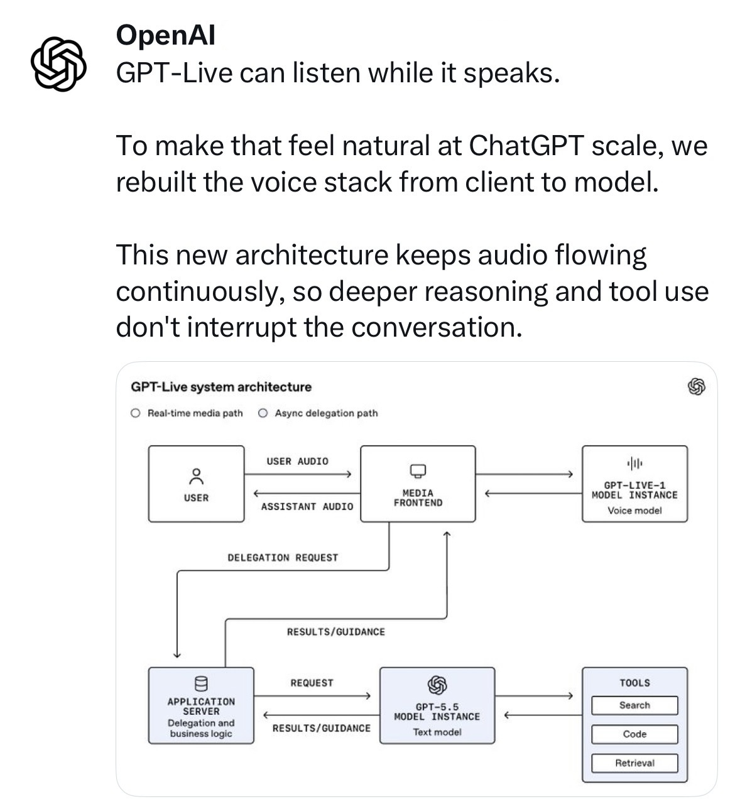
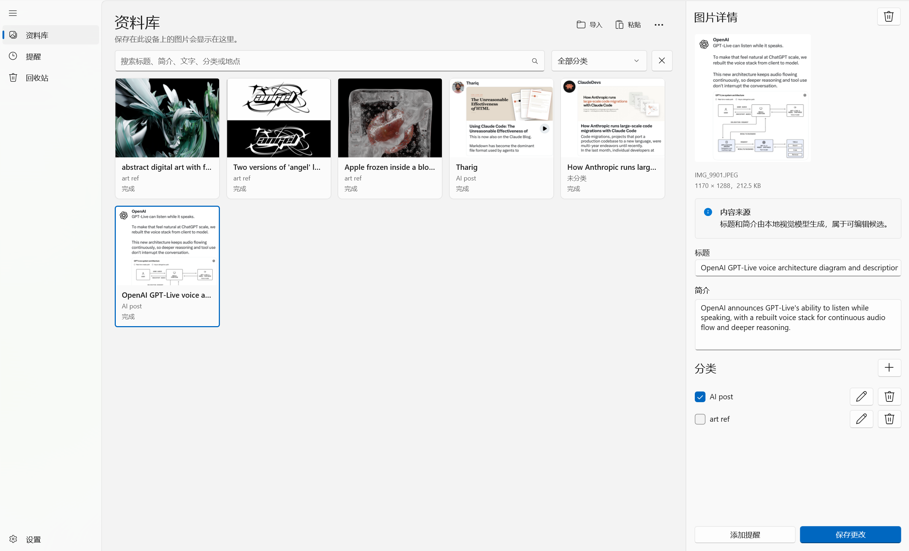
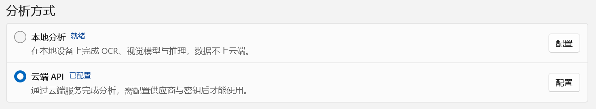
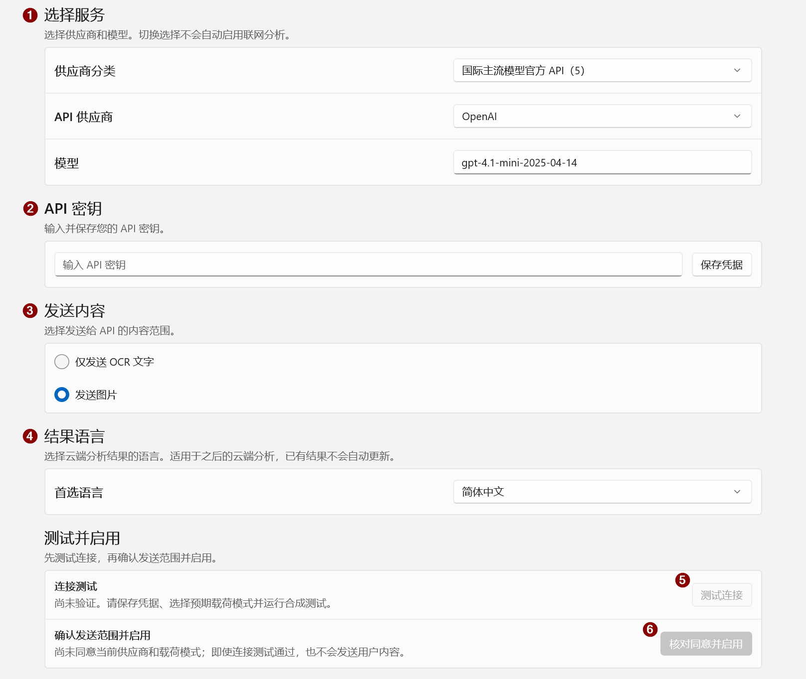
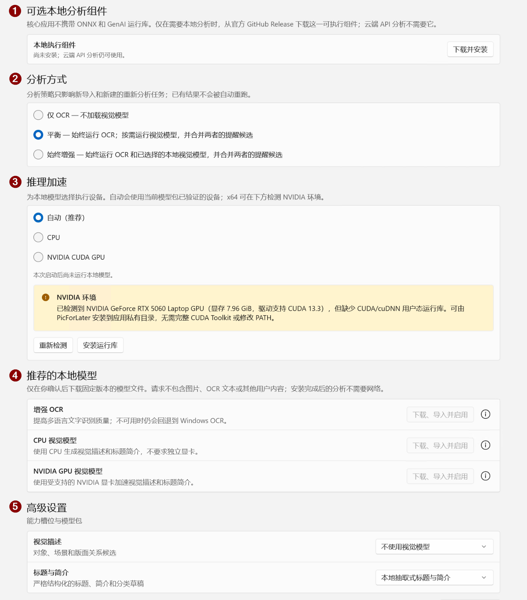
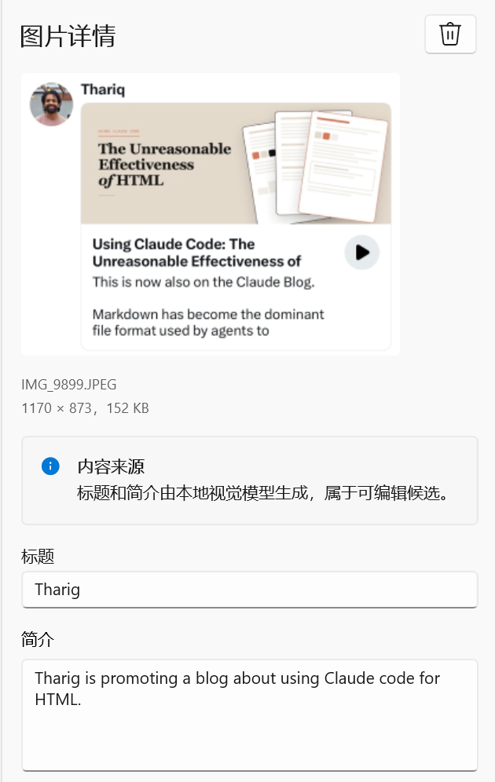
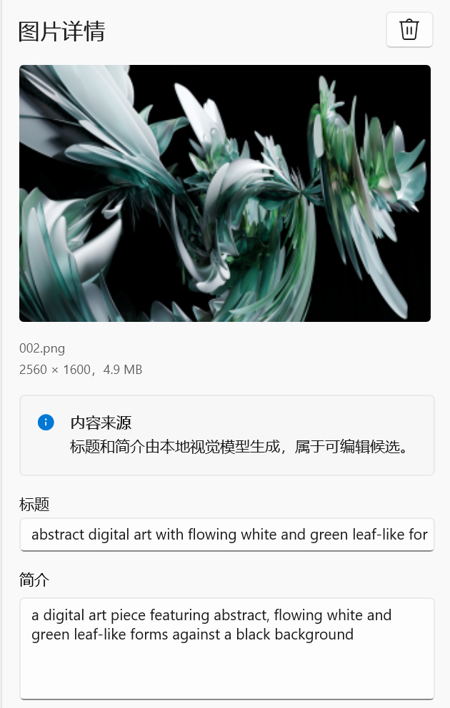
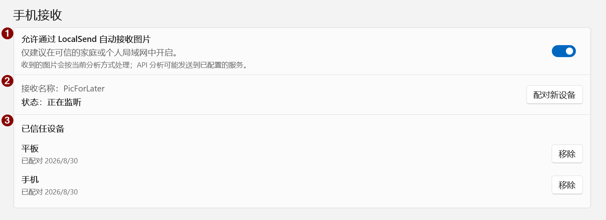

# PicForLater

[English](README.md) | **简体中文** | [繁體中文（台灣）](README.zh-TW.md)

PicForLater 是一款面向 Windows 的图片资料整理应用，用来保存那些“现在没空看，但之后还想认真看”的图片。

导入图片后，PicForLater 会保留不可变原图，并可通过**本地分析**或用户明确启用的**第三方 API**生成标题、简介、分类和提醒候选；分析结果由用户确认后再写入资料库或创建提醒。

## 使用场景

例如，你在浏览贴文时看到一条值得细读的内容，但当下没有时间：

1. 使用 <kbd>Win</kbd> + <kbd>Shift</kbd> + <kbd>S</kbd> 截图；
2. 将截图粘贴到 PicForLater；
3. 让应用生成标题和简介，并按需分类；
4. 等有时间时，再通过搜索、分类或摘要快速找回这张图。

<table>
  <tr>
    <td width="42%" align="center">
      
      <br>
      <sub>原始截图：稍后想继续阅读的内容</sub>
    </td>
    <td width="58%" align="center">
      
      <br>
      <sub>导入后：可在资料库中查看标题、简介与分类</sub>
    </td>
  </tr>
</table>

> 图片来源：OpenAI 的 X 贴文截图。

不只是贴文：只要是图片，都可以保存到 PicForLater，并按需生成标题、简介和分类，方便之后检索和回忆。

## 功能

- 导入、搜索、分类、查看和回收图片。
- 从图片内容提取日期、时间、地点和提醒候选；提醒仅在用户确认后创建。
- 使用 Windows 内置 OCR，也可按需安装增强的本地 OCR / 视觉模型。
- 支持本地模型、第三方 API，以及兼容接口的自定义服务。
- 允许连接其他设备导入图片并分析。
- 可选的全局快捷键可唤起 Windows 截图工具，并在截图完成后自动导入新图片。
- 提供中文和英文界面，支持深色模式与高对比度。
- 无账号、无广告、无产品遥测。

## 系统要求与安装

系统要求：Windows 11，或 [.NET 10 支持的 Windows 10 LTSC / Enterprise 版本](https://learn.microsoft.com/dotnet/core/install/windows)。

前往 [Releases](https://github.com/dogdreamson555/PicForLater/releases/) 下载安装程序：Intel / AMD 电脑选择 `PicForLater-Setup-<version>-x64.exe`，ARM64 电脑选择 `PicForLater-Setup-<version>-arm64.exe`。

- **首次安装**：保持联网，安装器会自动下载并安装所需运行库；如有管理员授权提示，选择“是”。
- **后续更新**：下载新版在线安装器，直接安装即可。
- **离线安装**：下载文件名包含 `Setup-Offline` 的同架构安装器，再复制到目标电脑运行。

> [!WARNING]
> 安装器暂未签名。确认安装包来自本仓库 Releases 后，如遇 SmartScreen 提示，可选择“更多信息” → “仍要运行”。

## 快速启用分析

PicForLater 支持两种主要分析方式：**本地分析**与**远程 API**。

<p align="center">
  
</p>

### 远程 API

选择服务商预设、填写 API Key 并测试连接即可配置远程分析；如果服务商要求通过系统环境变量提供密钥，则需要按对应服务商的要求自行配置。具体接口与能力见[远程 API 说明](docs/remote-api-providers.md)。

| 类型                     | 已内置的服务商 / 接口                                                                                                                 |
| ------------------------ | ------------------------------------------------------------------------------------------------------------------------------------- |
| 国际主流模型官方 API     | OpenAI、Anthropic / Claude、Google Gemini、xAI / Grok、Perplexity Sonar                                                               |
| 中国主流模型官方 API     | DeepSeek、月之暗面 / Kimi、腾讯混元、火山引擎 / 豆包、阿里云百炼 / 通义千问 Qwen、智谱 BigModel / GLM、百度智能云千帆 / 文心、MiniMax |
| 多模型聚合与高速推理平台 | SiliconFlow / SiliconCloud、OpenRouter、Groq、Together AI                                                                             |
| 本地运行与私有化部署     | Ollama、vLLM                                                                                                                          |
| 其他                     | 自定义兼容接口                                                                                                                        |

<p align="center">
  
</p>

启用步骤：

1. 在“供应商分类”中选择对应类型，并选择服务商。
2. 填入 API Key，点击“保存凭据”。
3. 选择发送内容。模型支持视觉输入时，推荐使用“发送图片”，通常能获得更准确的结果。
4. 选择输出语言。
5. 点击“测试连接”确认配置可用。
6. 核对远程分析的数据发送范围并确认启用。

### 本地分析

本地分析需要额外下载相关组件和模型，应用支持一键下载。

<p align="center">
  
</p>

启用步骤：

1. 一键下载本地分析组件。
2. 选择分析方式；如果设备性能允许，推荐使用“始终增强”。
3. 选择推理设备。使用 NVIDIA GPU 时，若缺少所需运行库，点击“安装运行库”；要求见[本地运行库说明](docs/qwen3-vl-runtime-prerequisites.md)。
4. 一键下载推荐模型。
5. 如有需要，在“高级设置”中为不同场景指定不同模型。

推荐模型：

| 用途                | 模型                                                                                                                                                      | 说明                         |
| ------------------- | --------------------------------------------------------------------------------------------------------------------------------------------------------- | ---------------------------- |
| OCR                 | [PP-OCRv6-small](https://www.paddleocr.ai/latest/en/version3.x/algorithm/PP-OCRv6/PP-OCRv6.html)                                                           | 用于本地文字识别             |
| CPU 视觉模型        | [Qwen3-VL-2B CPU Q4F32](https://huggingface.co/DogDreamson/picforlater-qwen3-vl-2b-onnx/tree/b0ffadcc56e0e736aa1310ff75f7c81147ac50bb/cpu-q4f32-rtnlast)   | 面向 CPU 的量化版本          |
| NVIDIA GPU 视觉模型 | [Qwen3-VL-2B CUDA Q4F16](https://huggingface.co/DogDreamson/picforlater-qwen3-vl-2b-onnx/tree/b0ffadcc56e0e736aa1310ff75f7c81147ac50bb/cuda-q4f16-rtnlast) | 面向 NVIDIA GPU 的 CUDA 版本 |

这些模型针对 PicForLater 的使用方式做了专门适配，目标是让多数常见电脑配置都能运行。

> [!IMPORTANT]
> NVIDIA GPU 视觉模型建议至少准备 **8 GB 显存**。

#### 推荐模型的分析结果示例

下面分别展示“贴文截图”和“复杂抽象图片”的分析结果。可以看出，即便是复杂抽象图片，本地推荐的2B模型也能很好地将其描述出来

<table>
  <tr>
    <td width="50%" align="center">
      
      <br>
      <sub>贴文截图：生成标题与简介</sub>
    </td>
    <td width="50%" align="center">
      
      <br>
      <sub>复杂抽象图片：生成标题与简介</sub>
    </td>
  </tr>
</table>

> 左图来源：Thariq 的贴文；右图来源：开发者在Blender渲染导出的图片

## 连接手机

<p align="center">
  
</p>

启用步骤：

0. 在手机 / 平板上安装 [LocalSend](https://localsend.org/download)。
1. 打开“允许通过 LocalSend 自动接收图片”。
2. 点击“配对新设备”，从发送端发送图片并输入 PIN 完成验证。
3. 配对成功后，设备会出现在“已信任设备”中，后续发送无需 PIN；设备名在 LocalSend 中设置。

## 常见问题

### 配置 API 时“测试连接”失败

先检查 API Key、模型名称、Endpoint、网络连接、账户余额 / 配额和服务状态。若配置正确仍然失败，将“高级设置”中的“思考规模”设为“关闭”后重试。

### API 分析没有返回结果

1. 右键对应项目，选择“重新分析”。
2. 如果长时间仍无结果，可删除该项目，并在回收站中永久删除后重新拖入或粘贴图片。
3. 如果问题可以稳定复现，请提交 Issue，并说明 API 配置、实际操作步骤和错误表现。
4. 如果图片不包含隐私或敏感信息，也可以附上可复现问题的样例图片，帮助定位问题。

### 图片导入失败

检查扩展名是否与真实格式一致，例如 JPEG 被误改为 PNG。请修复或转存图片；动态图片暂不支持导入。

### 手机接收问题

> [!CAUTION]
> 使用 PicForLater 的 LocalSend 时，需要关闭电脑端的官方 LocalSend 应用

| 问题                          | 常见原因                                                                   | 建议解决方案                                                                      |
| ----------------------------- | -------------------------------------------------------------------------- | --------------------------------------------------------------------------------- |
| 手机完全看不到`PicForLater` | 不同局域网、访客 Wi‑Fi/AP 隔离、VPN、UDP 发现被拦截、iOS 本地网络权限关闭 | 两端连接同一非访客网络；暂时关闭 VPN；路由器关闭 AP Isolation；也可用个人热点测试 |
| 显示“正在监听（发现受限）”  | UDP 53317/组播发现失败，但 TCP 服务可能仍正常                              | 检查防火墙、VPN和虚拟网卡；关闭再开启手机接收                                     |
| 手机能看到，但连接超时/失败   | TCP 53317 被防火墙或安全软件拦截                                           | 优先允许`PicForLater.App.exe` 通过专用网络防火墙；不要永久关闭防火墙            |
| 显示“服务异常”              | 53317 被电脑端 LocalSend、另一 PicForLater 实例或其他程序占用              | 完全退出电脑端 LocalSend 和重复实例，再关闭/开启手机接收                          |
| 手机选择 PicForLater 后被拒绝 | 新设备尚未配对、信任已移除或手机证书身份变化                               | 点击“配对新设备”，在两分钟内输入 PIN 并发送至少一张支持的图片                   |
| 传输成功但导入失败            | HEIC/GIF/PDF、不匹配的扩展名、损坏图片、超限                               | 转存为真实的 JPEG/PNG/WebP；不要只伪造扩展名；拆分大批次                          |
| 显示“已存在”                | 图片内容与资料库已有文件重复                                               | 正常去重结果，不是连接失败                                                        |

#### 被防火墙拦截

当前 Setup 不主动创建防火墙规则，因此干净电脑可能需要用户操作。

首选方法：

1. 打开“Windows 安全中心”。
2. 进入“防火墙和网络保护”。
3. 选择“允许应用通过防火墙”。
4. 点击“更改设置”→“允许其他应用”。
5. 选择实际安装的 `PicForLater.App.exe`。
6. 只勾选“专用网络”。

备用方法：

在“高级设置→入站规则”中分别允许：

- TCP 本地端口 53317
- UDP 本地端口 53317
- 仅限专用网络

> [!CAUTION]
> 提交公开 Issue 时，请勿上传 API Key、私人图片、未公开漏洞细节或其他敏感信息。

## Privacy

PicForLater 默认在本地处理和保存图片，无账号、无广告、无产品遥测。远程 API 分析需要用户明确启用，并按所选模式发送 OCR 文字或处理后的图片；检查更新、下载组件及局域网接收也会涉及网络访问。

完整的数据发送范围、本地存储与凭据保护、截图与剪贴板访问，以及删除和卸载说明，见 [隐私说明（PRIVACY.md）](PRIVACY.md)。

## Security

- API 凭据仅使用 Windows 当前用户 Credential Locker；日志、持久化错误和自动化测试不包含 secret 或用户载荷。
- 模型和可选可执行组件按固定来源、大小、SHA-256 与签名清单验证；核心 Setup 不携带模型权重或本地推理 worker。
- Setup 由 GitHub Actions 在同一次 Release publish 中生成。
- 安全问题的报告方式见 [SECURITY.md](SECURITY.md)。不要在公开 Issue 中粘贴密钥、私人图片、未公开漏洞细节或可利用样本。

## 从源码构建

需要：

- Windows；
- Visual Studio 2022 的 Windows App SDK / C++ 桌面构建组件；
- PowerShell 7；
- .NET SDK 10.0.302 或同一 10.0.3xx feature band 的更高补丁版本（由 `global.json` 约束）。

构建安装器还需要 Inno Setup 6。

```powershell
dotnet restore .\PicForLater.slnx --locked-mode
dotnet build .\PicForLater.slnx -c Release --no-restore
dotnet test .\PicForLater.slnx -c Release --no-build --no-restore

.\tools\release\Build-Setup.ps1 -Platform x64 -Distribution Both
```

性能基线见 [docs/performance.md](docs/performance.md)。

## License

PicForLater 以 [MIT License](LICENSE.txt) 发布。第三方依赖、资源和按需组件的用途与来源见 [THIRD-PARTY-NOTICES.md](THIRD-PARTY-NOTICES.md)；随分发保留的上游许可证原文见 [licenses/README.md](licenses/README.md)。模型与第三方服务仍受各自条款约束。
