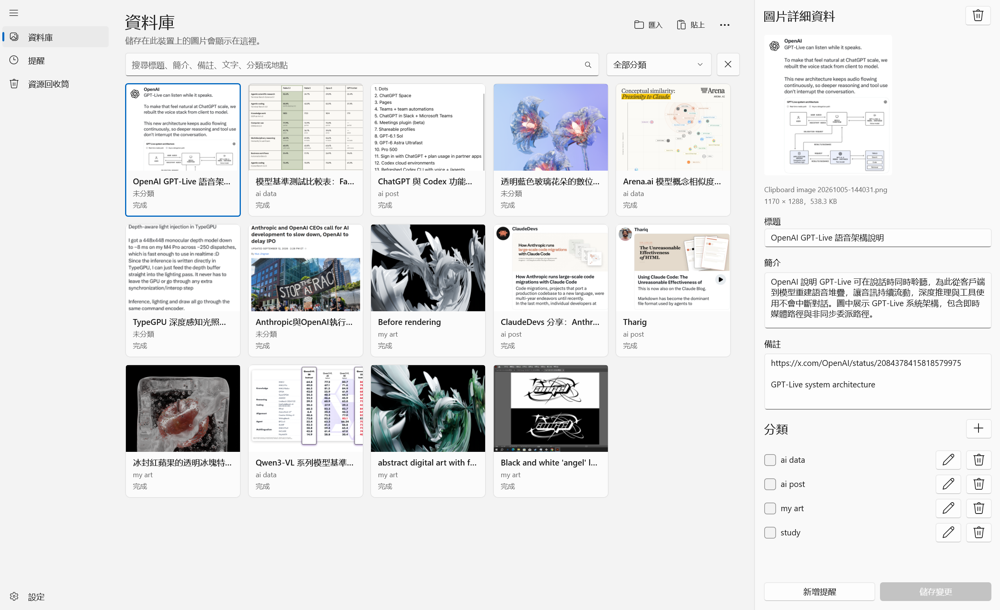
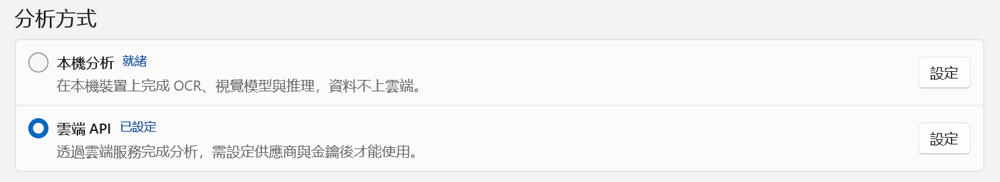
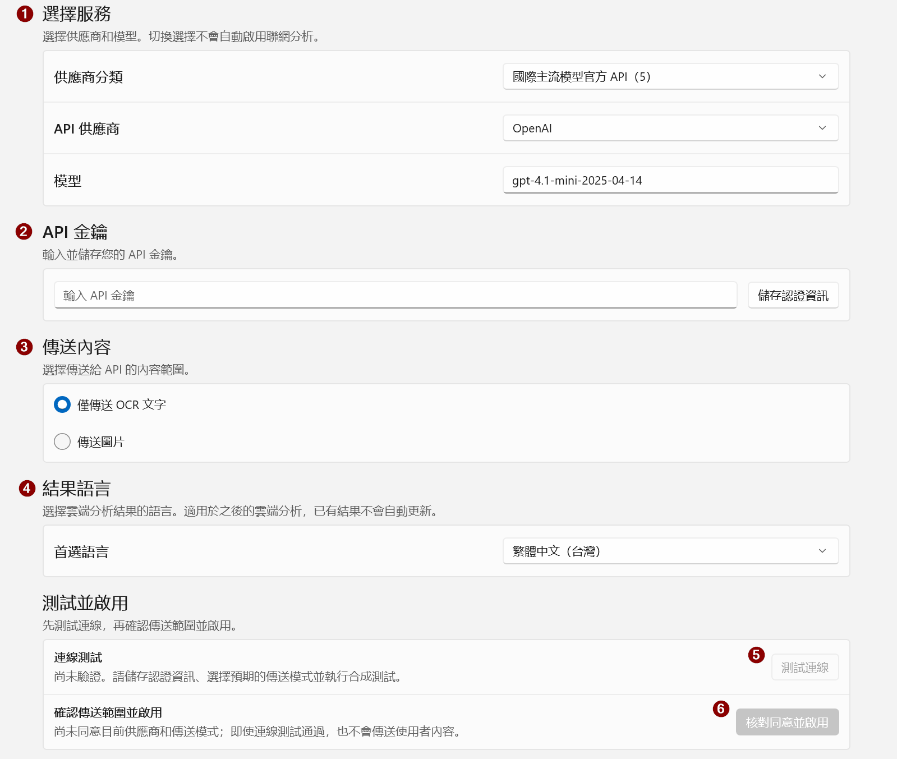
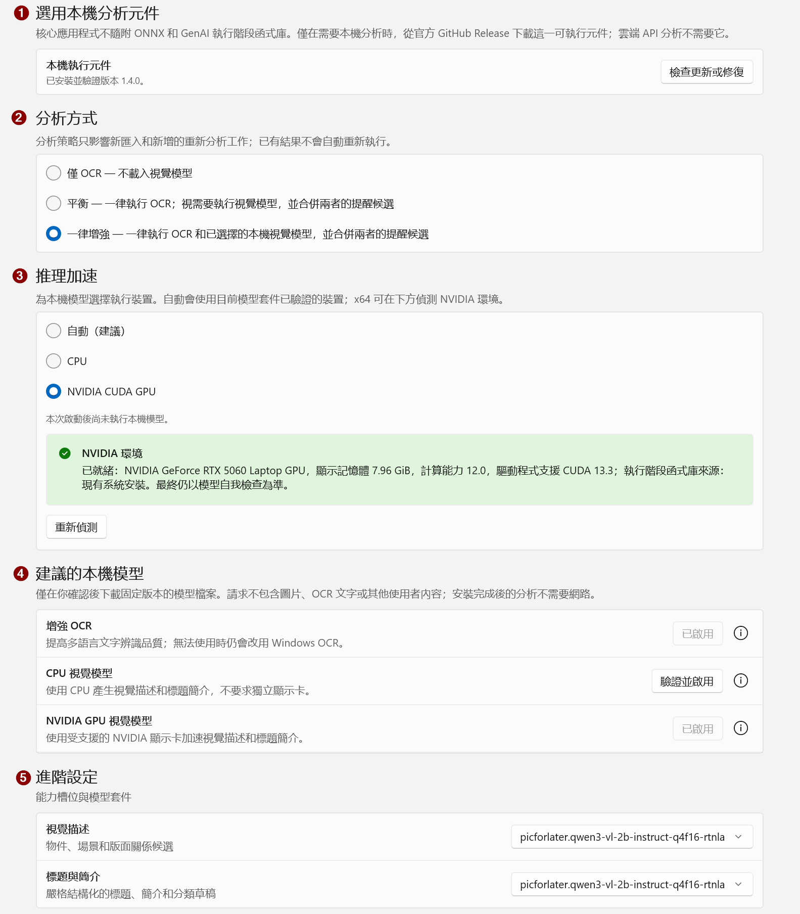
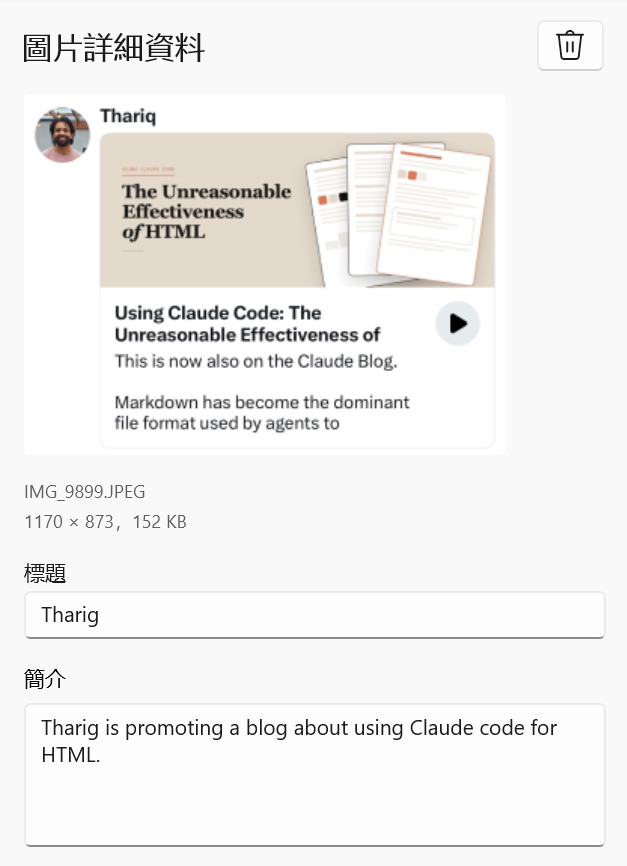
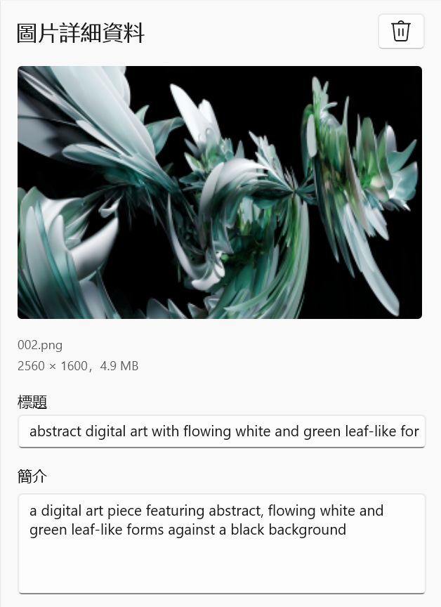
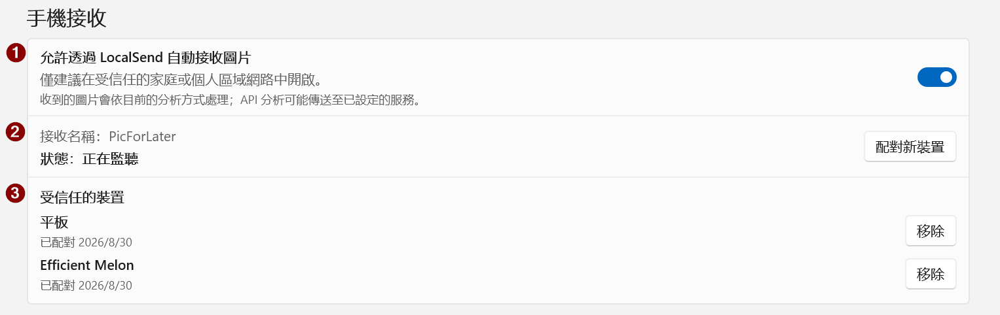

# PicForLater

[English](README.md) | [简体中文](README.zh-CN.md) | **繁體中文（台灣）**

PicForLater 是一款適用於 Windows 的圖片整理應用程式，可用來保存那些「現在沒空看，但之後還想仔細閱讀」的圖片。

匯入圖片後，PicForLater 會保留不可變更的原始圖片，並可透過**本機分析**或使用者明確啟用的**第三方 API**，產生標題、簡介、分類與提醒候選項目；使用者確認分析結果後，才會將結果寫入資料庫或建立提醒。

## 使用情境

例如，你瀏覽貼文時看到值得仔細閱讀的內容，卻沒有時間當下處理：

1. 按下 <kbd>Win</kbd> + <kbd>Shift</kbd> + <kbd>S</kbd> 擷取螢幕畫面；
2. 將擷取的畫面貼到 PicForLater；
3. 讓應用程式產生標題和簡介，並視需要分類；
4. 有空時，再透過搜尋、分類或摘要快速找回這張圖片。

<table>
  <tr>
    <td width="42%" align="center">
      
      <br>
      <sub>原始螢幕截圖：稍後想接著閱讀的內容</sub>
    </td>
    <td width="58%" align="center">
      
      <br>
      <sub>匯入後：可在資料庫中查看標題、簡介與分類</sub>
    </td>
  </tr>
</table>

> 圖片來源：OpenAI 的 X 貼文螢幕截圖。

不只貼文：只要是圖片，都可以保存到 PicForLater，並視需要產生標題、簡介和分類，方便日後搜尋與回想。

## 功能

- 匯入、搜尋、分類、檢視圖片，並可將圖片移至資源回收筒。
- 從圖片內容擷取日期、時間、地點與提醒候選項目；只有使用者確認後才會建立提醒。
- 使用 Windows 內建 OCR，也可視需要安裝增強型本機 OCR／視覺模型。
- 支援本機模型、第三方 API，以及相容介面的自訂服務。
- 可連線至其他裝置，以匯入圖片並進行分析。
- 可選用全域快速鍵來開啟 Windows 螢幕擷取工具，並在擷取完成後自動匯入新圖片。
- 提供中文與英文介面，支援深色模式與高對比模式。
- 不需帳號、沒有廣告，也不收集產品遙測資料。

## 系統需求與安裝

系統需求：Windows 11，或 [.NET 10 支援的 Windows 10 LTSC／Enterprise 版本](https://learn.microsoft.com/dotnet/core/install/windows)。

前往 [Releases](https://github.com/dogdreamson555/PicForLater/releases/) 下載安裝程式：Intel／AMD 電腦請選擇 `PicForLater-Setup-<version>-x64.exe`，ARM64 電腦請選擇 `PicForLater-Setup-<version>-arm64.exe`。

- **首次安裝**：請保持網路連線，安裝程式會自動下載並安裝所需執行階段；若出現系統管理員授權提示，請選擇「是」。
- **後續更新**：下載新版線上安裝程式後直接安裝即可。
- **離線安裝**：下載檔名包含 `Setup-Offline` 的同架構安裝程式，再複製到目標電腦執行。

> [!WARNING]
> 安裝程式目前尚未簽署。確認安裝檔來自本儲存庫的 Releases 後，若出現 SmartScreen 提示，可選擇「其他資訊」→「仍要執行」。

## 快速啟用分析

PicForLater 支援兩種主要分析方式：**本機分析**與**遠端 API**。

<p align="center">
  
</p>

### 遠端 API

選擇服務商預設值、填入 API Key 並測試連線，即可設定遠端分析；如果服務商要求透過系統環境變數提供金鑰，則需依該服務商的指示自行設定。介面與功能詳情請參閱[遠端 API 說明](docs/remote-api-providers.md)。

| 類型                   | 內建服務商／介面                                                                                                                       |
| ---------------------- | -------------------------------------------------------------------------------------------------------------------------------------- |
| 國際主流模型官方 API   | OpenAI、Anthropic / Claude、Google Gemini、xAI / Grok、Perplexity Sonar                                                                 |
| 中國主流模型官方 API   | DeepSeek、月之暗面 / Kimi、騰訊混元、火山引擎 / 豆包、阿里雲百煉 / 通義千問 Qwen、智譜 BigModel / GLM、百度智能雲千帆 / 文心、MiniMax |
| 多模型聚合與高速推理平台 | SiliconFlow / SiliconCloud、OpenRouter、Groq、Together AI                                                                            |
| 本機執行與私有化部署   | Ollama、vLLM                                                                                                                            |
| 其他                   | 自訂相容介面                                                                                                                           |

<p align="center">
  
</p>

啟用步驟：

1. 在「供應商分類」中選擇對應類型，再選擇服務商。
2. 輸入 API Key，點選「儲存認證資訊」。
3. 選擇要傳送的內容。模型支援視覺輸入時，建議選擇「傳送圖片」，通常可取得更準確的結果。
4. 選擇輸出語言。
5. 點選「測試連線」確認設定可用。
6. 確認遠端分析會傳送的資料範圍，然後確認啟用。

### 本機分析

本機分析需要額外下載相關元件與模型，應用程式支援一鍵下載。

<p align="center">
  
</p>

啟用步驟：

1. 一鍵下載本機分析元件。
2. 選擇分析方式；若裝置效能足夠，建議使用「一律增強」。
3. 選擇推論裝置。使用 NVIDIA GPU 時，若缺少必要執行階段函式庫，請點選「安裝執行階段函式庫」；需求請參閱[本機執行階段說明](docs/qwen3-vl-runtime-prerequisites.md)。
4. 一鍵下載建議模型。
5. 如有需要，可在「進階設定」中為不同情境指定不同模型。

建議模型：

| 用途                | 模型                                                                                                                                                      | 說明                          |
| ------------------- | --------------------------------------------------------------------------------------------------------------------------------------------------------- | ----------------------------- |
| OCR                 | [PP-OCRv6-small](https://www.paddleocr.ai/latest/en/version3.x/algorithm/PP-OCRv6/PP-OCRv6.html)                                                           | 用於本機文字辨識              |
| CPU 視覺模型        | [Qwen3-VL-2B CPU Q4F32](https://huggingface.co/DogDreamson/picforlater-qwen3-vl-2b-onnx/tree/b0ffadcc56e0e736aa1310ff75f7c81147ac50bb/cpu-q4f32-rtnlast)   | 適用於 CPU 的量化版本         |
| NVIDIA GPU 視覺模型 | [Qwen3-VL-2B CUDA Q4F16](https://huggingface.co/DogDreamson/picforlater-qwen3-vl-2b-onnx/tree/b0ffadcc56e0e736aa1310ff75f7c81147ac50bb/cuda-q4f16-rtnlast) | 適用於 NVIDIA GPU 的 CUDA 版本 |

這些模型針對 PicForLater 的使用情境特別調整，目標是讓多數常見電腦都能執行。

> [!IMPORTANT]
> NVIDIA GPU 視覺模型建議至少準備 **8 GB 顯示記憶體**。

#### 建議模型的分析結果範例

以下分別展示「貼文螢幕截圖」和「複雜抽象圖片」的分析結果。可以看到，即使是複雜抽象圖片，本機建議使用的 2B 模型也能清楚描述內容。

<table>
  <tr>
    <td width="50%" align="center">
      
      <br>
      <sub>貼文螢幕截圖：產生標題與簡介</sub>
    </td>
    <td width="50%" align="center">
      
      <br>
      <sub>複雜抽象圖片：產生標題與簡介</sub>
    </td>
  </tr>
</table>

> 左圖來源：Thariq 的貼文；右圖來源：開發者使用 Blender 渲染並匯出的圖片。

## 連接手機

<p align="center">
  
</p>

啟用步驟：

0. 在手機／平板上安裝 [LocalSend](https://localsend.org/download)。
1. 開啟「允許透過 LocalSend 自動接收圖片」。
2. 點選「配對新裝置」，從傳送端傳送圖片並輸入 PIN 完成驗證。
3. 配對成功後，裝置會顯示在「受信任的裝置」中，之後傳送圖片便不需輸入 PIN；裝置名稱可在 LocalSend 中設定。

## 常見問題

### 設定 API 時「測試連線」失敗

請先檢查 API Key、模型名稱、Endpoint、網路連線、帳戶餘額／配額及服務狀態。若設定正確但仍失敗，請在「進階設定」中將「思考規模」設為「關閉」後再試。

### API 分析沒有傳回結果

1. 在對應項目上按一下滑鼠右鍵，選擇「重新分析」。
2. 若長時間仍沒有結果，可刪除該項目，並在資源回收筒中永久刪除後，再重新拖曳或貼上圖片。
3. 若問題可穩定重現，請提交 Issue，並說明 API 設定、實際操作步驟及錯誤情況。
4. 若圖片不含隱私或敏感資訊，也可以附上可重現問題的範例圖片，協助找出問題。

### 匯入圖片失敗

請檢查副檔名是否與實際格式相符，例如 JPEG 被誤改為 PNG。請修復或轉存圖片；目前不支援匯入動態圖片。

### 手機接收問題

> [!CAUTION]
> 使用 PicForLater 的 LocalSend 時，請關閉電腦上的官方 LocalSend 應用程式。

| 問題                         | 常見原因                                                                     | 建議解決方式                                                                      |
| ---------------------------- | ---------------------------------------------------------------------------- | --------------------------------------------------------------------------------- |
| 手機完全看不到 `PicForLater` | 未連線到相同區域網路、訪客 Wi‑Fi／AP 隔離、VPN、UDP 探索遭封鎖、iOS 關閉本機網路權限 | 讓兩端連上相同的非訪客網路；暫時關閉 VPN；在路由器上關閉 AP Isolation；也可使用個人熱點測試 |
| 顯示「正在監聽（網絡探索功能受限）」 | UDP 53317／多點傳送探索失敗，但 TCP 服務可能仍正常運作                    | 檢查防火牆、VPN 與虛擬網卡；關閉再重新開啟手機接收                              |
| 手機看得到，但連線逾時／失敗 | TCP 53317 遭防火牆或安全軟體封鎖                                             | 優先允許 `PicForLater.App.exe` 通過私人網路防火牆；不要永久關閉防火牆              |
| 顯示「服務異常」             | 53317 已被電腦上的 LocalSend、另一個 PicForLater 執行個體或其他程式占用        | 完全結束電腦上的 LocalSend 和重複執行的 PicForLater，再關閉並重新開啟手機接收     |
| 手機選擇 PicForLater 後遭拒絕 | 新裝置尚未配對、信任已移除或手機憑證身分已變更                               | 點選「配對新裝置」，並在兩分鐘內輸入 PIN、傳送至少一張支援的圖片                   |
| 傳輸成功但匯入失敗           | HEIC／GIF／PDF、副檔名不符、圖片損毀或超出限制                                | 轉存為實際格式的 JPEG／PNG／WebP；不要只修改副檔名；大量傳送時請分批               |
| 顯示「已存在」               | 圖片內容與資料庫中的既有檔案重複                                             | 這是正常的重複項目排除結果，並非連線失敗                                        |

#### 遭防火牆封鎖

目前的 Setup 不會主動建立防火牆規則，因此在全新電腦上可能需要自行設定。

建議方式：

1. 開啟「Windows 安全性」。
2. 進入「防火牆與網路保護」。
3. 選擇「允許應用程式通過防火牆」。
4. 點選「變更設定」→「允許其他應用程式」。
5. 選取實際安裝位置中的 `PicForLater.App.exe`。
6. 只勾選「私人網路」。

其他方式：

在「進階安全性 → 輸入規則」中分別允許：

- TCP 本機連接埠 53317
- UDP 本機連接埠 53317
- 僅限私人網路

> [!CAUTION]
> 提交公開 Issue 時，請勿上傳 API Key、私人圖片、尚未公開的漏洞細節或其他敏感資訊。

## 隱私權

PicForLater 預設在本機處理並儲存圖片，不需帳號、沒有廣告，也不收集產品遙測資料。遠端 API 分析需要使用者明確啟用，並會依所選模式傳送 OCR 文字或處理後的圖片；檢查更新、下載元件及透過區域網路接收圖片也會使用網路。

資料傳送範圍、本機儲存與認證資訊保護、螢幕擷取與剪貼簿存取，以及刪除和解除安裝方式，請參閱[隱私權說明（PRIVACY.md）](PRIVACY.md)。

## 安全性

- API 認證資訊只會存放在 Windows 目前使用者的 Credential Locker；記錄檔、持續保存的錯誤資訊及自動化測試都不會包含密鑰或使用者內容。
- 模型及選用的可執行元件會依固定來源、檔案大小、SHA-256 與簽章清單進行驗證；核心 Setup 不包含模型權重或本機推論工作處理程序。
- Setup 由 GitHub Actions 在同一次 Release 發佈作業中產生。
- 安全問題回報方式請參閱 [SECURITY.md](SECURITY.md)。請勿在公開 Issue 中貼上密鑰、私人圖片、尚未公開的漏洞細節或可利用的樣本。

## 從原始碼建置

需求：

- Windows；
- Visual Studio 2022 的 Windows App SDK／C++ 桌面開發元件；
- PowerShell 7；
- .NET SDK 10.0.302，或相同 10.0.3xx 功能版本系列中的較新修補版本（由 `global.json` 限制）。

建置安裝程式還需要 Inno Setup 6。

```powershell
dotnet restore .\PicForLater.slnx --locked-mode
dotnet build .\PicForLater.slnx -c Release --no-restore
dotnet test .\PicForLater.slnx -c Release --no-build --no-restore

.\tools\release\Build-Setup.ps1 -Platform x64 -Distribution Both
```

效能基準請參閱 [docs/performance.md](docs/performance.md)。

## 授權

PicForLater 以 [MIT License](LICENSE.txt) 發佈。第三方相依套件、資源及選用元件的用途與來源，請參閱 [THIRD-PARTY-NOTICES.md](THIRD-PARTY-NOTICES.md)；隨散佈內容保留的上游授權原文請參閱 [licenses/README.md](licenses/README.md)。模型與第三方服務仍受各自條款約束。
